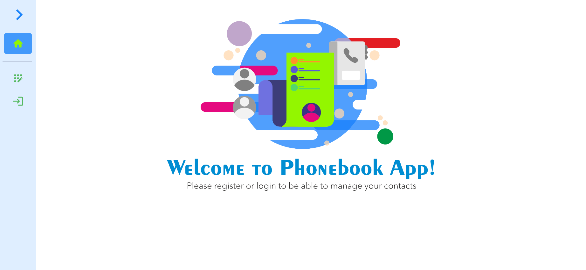
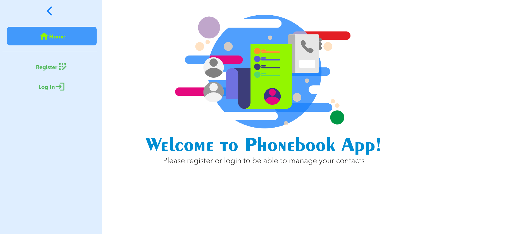
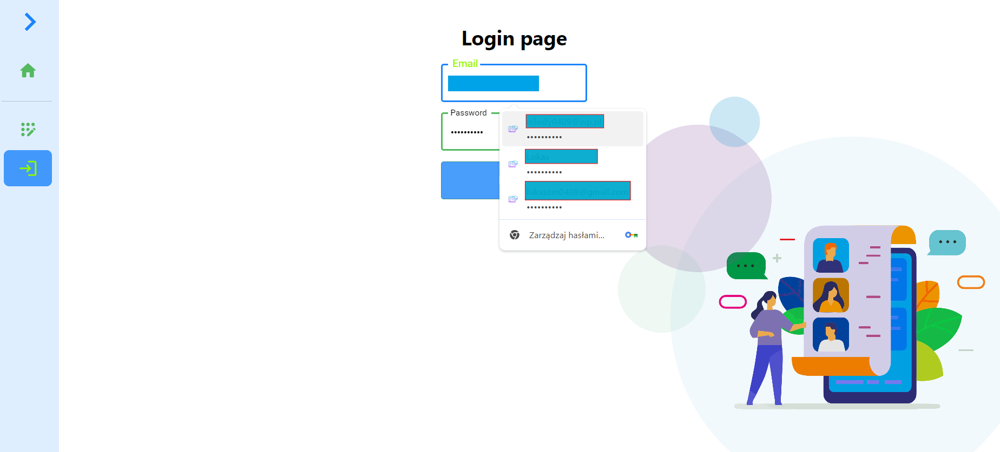

# goit-react-hw-08-phonebook

## Overview

goit-react-hw-08-phonebook is a React-based phonebook application. The project
allows users to add, remove, and manage their phone contacts efficiently. It
includes features such as data persistence using Redux Toolkit, stylish UI
components from Material-UI, and a responsive design.

## Features

- Add new contacts
- Delete existing contacts
- Search contacts by name
- Search contacts by name
- Persist data using Redux Toolkit
- Responsive design using Material-UI
- Notifications with Notiflix
- Routing with React Router DOM
- Helmet for managing document head

## Technologies Used

- React
- Redux Toolkit
- Material-UI
- Axios
- Notiflix
- Helmet
- Framer Motion
- Styled Components
- React Router DOM

## Installation

To set up the project locally, follow these steps:

1. Clone the repository:.

2. Install dependencies:.

3. Run the application:.

## Scripts

Start the development server:.

## Scope of functionality

1. Home Page

,

2. Register Page

3. Login Page

,

4. Contact Page

,

5. Contact Add

,

6. Modal- Edit Contact

## Contact

GitHub: LukaszMarchlinski
